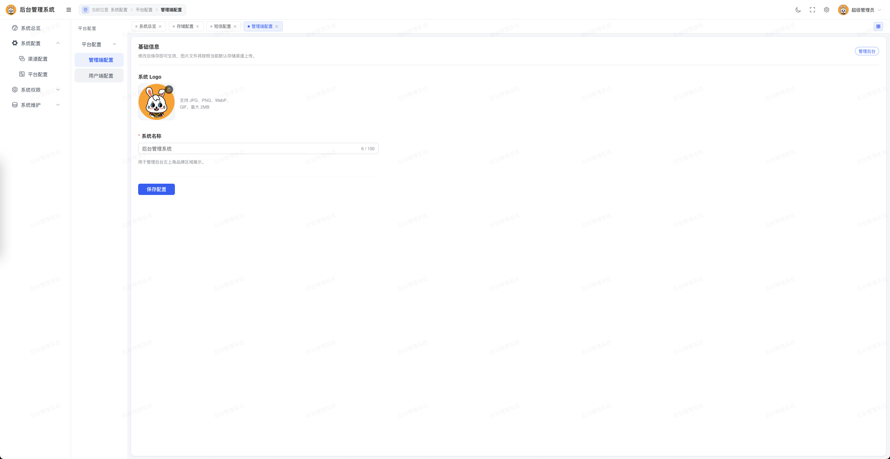
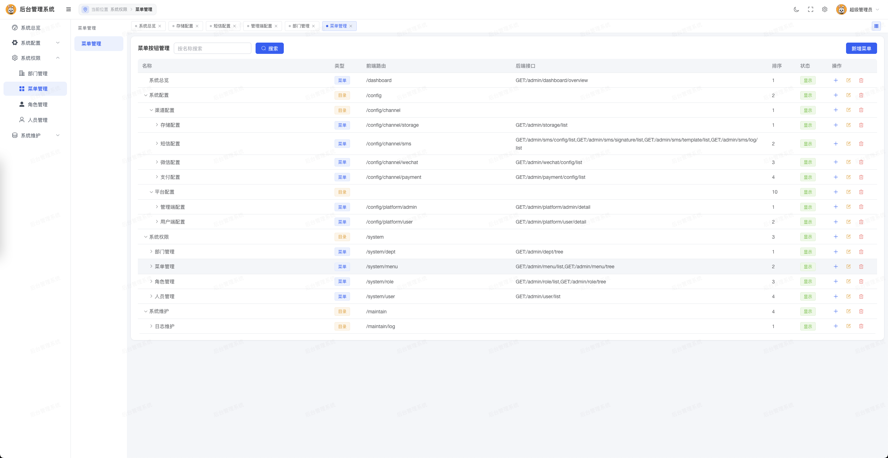
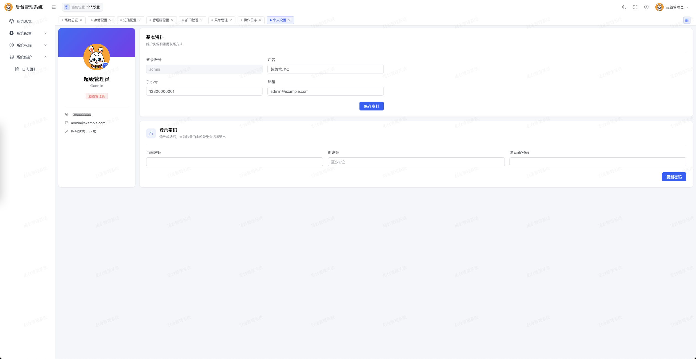

# Go Backend Frame · Server API

一个面向后台管理系统和用户端接口的 Go 基础框架。项目基于 Gin、GORM、MySQL、Redis 和 JWT，提供双端服务入口、RBAC 权限、动态菜单、登录会话、操作审计、文件上传及常见业务渠道配置。

> 当前项目仍在持续完善中，欢迎通过 Issue 或 Pull Request 提交问题与改进建议。

[English](README_EN.md)

| 官网地址 | 管理端地址 | 接口端地址 | 接口文档 |
| --- | --- | --- | --- |
| [访问官网](https://www.tutudati.com/) | [管理端源码](https://gitee.com/open-source-project-open/go_basic_frame_admin) | [接口端源码](https://gitee.com/open-source-project-open/go_basic_frame_api) | [接口文档](https://s.apifox.cn/a42d392b-c5e9-4b75-8f54-e1c26339b262) |

## 特性

- 管理端 API 与用户端 API 独立启动、独立路由，可分别部署。
- JWT + Redis 登录态，支持主动退出、修改密码失效和管理员踢下线。
- 菜单、角色、部门均支持树形结构，管理端支持接口级 RBAC 鉴权。
- 统一请求响应、参数校验、分页、数据库错误和密码处理能力。
- 自动记录管理端操作日志，请求敏感字段脱敏；日志查询本身不会重复写入日志。
- 支持本地、阿里云 OSS、腾讯云 COS、七牛云 Kodo 和 MinIO 文件存储。
- 业务表只保存文件相对路径，响应时根据当前存储配置补全访问地址。
- 内置短信、微信、支付、存储和平台基础配置模块。
- 会员用户管理：列表筛选展示与账号启用/禁用，手机号通过 `pkg/mask` 统一脱敏展示。
- 服务启动自检、HTTP 超时控制和优雅停机。
- 数据库统一使用 `utf8mb4_general_ci`。
- 配套管理端 OpenAPI 文档、前后端代码规范和可直接复用的代码规范 Skill。

## 技术栈

| 类别 | 技术 |
| --- | --- |
| 语言 | Go 1.26 |
| Web | Gin 1.10 |
| ORM | GORM 1.31 + MySQL Driver |
| 缓存 | Redis 5+ |
| 鉴权 | JWT v5 + Redis |
| CLI | Cobra |
| 配置 | YAML |
| 密码 | bcrypt |
| 存储 | Local / Aliyun OSS / Tencent COS / Qiniu / MinIO |

## 项目结构

```text
server_api/
├── cmd/                       # CLI 命令与服务生命周期
├── config/                    # 配置结构和加载逻辑
├── internal/
│   ├── admin/                 # 管理端业务模块
│   │   ├── controller/        # 参数绑定和统一响应
│   │   ├── logic/             # 业务逻辑
│   │   ├── middleware/        # 权限与操作日志
│   │   ├── param/             # 请求结构
│   │   ├── permission/        # RBAC 权限计算与缓存
│   │   └── resp/              # 响应结构
│   ├── api/                   # 用户端业务模块
│   └── common/                # 双端共用的业务基础能力
│       ├── app/               # MySQL、Redis 初始化与检查
│       ├── auth/              # 登录态与 JWT
│       ├── enums/             # 业务枚举
│       ├── middleware/        # 通用中间件
│       ├── model/             # GORM 数据模型
│       └── upload/            # 上传和文件地址解析
├── pkg/                       # 无业务归属的通用工具
├── router/                    # admin/api 路由入口
├── sql/                       # 数据库增量脚本
├── uploads/                   # 本地上传目录，不提交到仓库
├── docs/                      # 项目文档
│   ├── admin_openapi.yaml     # 管理端 OpenAPI 3.0 文档，可直接导入 Apifox
│   ├── CODE_STYLE.md          # 前后端完整代码规范
│   └── code-standards/        # 代码规范 Skill，供 AI 编码助手复用
│       ├── SKILL.md           # Skill 入口：场景判断、落地顺序、速查规则
│       └── references/        # backend-go.md / frontend-vue.md 细则与模板
├── config.example.yaml        # 配置模板
├── go.mod
└── main.go
```

## 环境要求

- Go 1.26 或更高版本
- MySQL 5.7+ 或 MySQL 8.0+
- Redis 5+

## 快速开始

### 1. 获取代码并安装依赖

```bash
git clone https://gitee.com/open-source-project-open/go_basic_frame_api.git
cd go_basic_frame_api
go mod download
```

### 2. 初始化数据库

项目不使用 `AutoMigrate`，数据库结构必须通过 SQL 脚本维护。

当前 `sql/` 目录包含功能增量脚本，例如：

```bash
mysql -uroot -p your_database < sql/platform_config.sql
```

基础数据库初始化脚本应包含 `internal/common/model` 中声明的全部表。服务启动时会执行表完整性检查，缺表或 `sys_user` 没有初始账号时会拒绝启动。

> 当前仓库尚未提供完整的 `schema.sql`。正式对外发布前，建议补充一份可重复初始化的新库脚本，并将后续结构调整继续拆分为独立增量脚本。

### 3. 创建配置文件

```bash
cp config.example.yaml config.yaml
```

修改 MySQL、Redis 和 JWT 配置。生产环境必须替换 JWT 密钥：

```bash
openssl rand -hex 32
```

主要配置项：

| 配置 | 说明 | 示例 |
| --- | --- | --- |
| `version` | 系统版本号（必填），未设置时服务拒绝启动 | `v0.0.3` |
| `server.admin_addr` | 管理端 API 地址 | `:8001` |
| `server.api_addr` | 用户端 API 地址 | `:8002` |
| `mysql.*` | MySQL 连接和连接池 | 见配置模板 |
| `redis.*` | Redis 地址、密码和 DB | 见配置模板 |
| `jwt.secret` | JWT 签名密钥 | 随机强密钥 |
| `jwt.expire_hours` | 登录有效期 | `24` |
| `log.level` | 日志级别 | `info` |

`config.yaml` 可能包含数据库密码和密钥，请勿将真实生产配置提交到公开仓库。

### 4. 启动服务

```bash
# 管理端 API，默认监听 :8001
go run . service admin -c config.yaml

# 用户端 API，默认监听 :8002
go run . service api -c config.yaml
```

### 5. 编译

```bash
go build -o bin/server_api .

./bin/server_api service admin -c config.yaml
./bin/server_api service api -c config.yaml
```

其他命令：

```bash
go run . version
go run . help
```

## 接口约定

### 统一响应

接口通过 `pkg/response` 返回统一 JSON：

```json
{
  "code": 0,
  "msg": "success",
  "data": {}
}
```

常用业务码：

| Code | 含义 |
| --- | --- |
| `0` | 成功 |
| `400` | 参数错误 |
| `401` | 未登录或登录失效 |
| `403` | 无接口权限 |
| `500` | 业务或服务异常 |
| `503` | 依赖服务暂时不可用 |

### 鉴权

受保护接口使用 Bearer Token：

```http
Authorization: Bearer <token>
```

- 管理端：`Auth → Permission → OperationLog`。
- 用户端：`Auth`。
- 超级管理员跳过接口权限匹配，但仍需有效登录态。
- 普通管理员的接口权限来自角色绑定菜单的 `METHOD:/route` 配置。

### 服务入口

| 服务 | 前缀 | 默认端口 | 说明 |
| --- | --- | --- | --- |
| 管理端 | `/admin` | `8001` | RBAC、配置和系统管理 |
| 用户端 | `/api` | `8002` | 用户登录、资料和上传 |
| 本地文件 | `/files/*filepath` | 两端 | 仅本地存储渠道使用 |

路由是接口事实来源，完整列表请查看 [router/admin.go](router/admin.go) 和 [router/api.go](router/api.go)。

管理端接口同时维护了一份 OpenAPI 3.0 文档：[docs/admin_openapi.yaml](docs/admin_openapi.yaml)。可直接在 Apifox / Postman / Swagger UI 中导入，导入后把 `servers.url` 改为实际访问地址即可调试。

## 数据库规范

- 所有表和字段必须添加数据库注释。
- 字符字段统一使用 `utf8mb4_general_ci`。
- 枚举值从 `1` 开始，并集中定义在 `internal/common/enums`。
- GORM Model 必须包含 `gorm`、`json` 标签和字段注释。
- 表关联关系定义在响应结构中，不在 Model 中耦合业务响应。
- 能使用 GORM `Preload` 的关联查询优先使用预加载。
- 文件业务字段只保存相对路径；`sys_upload_file` 同时保存上传时的相对路径与完整地址。
- 结构变更通过 `sql/` 中的增量脚本交付，禁止依赖运行时自动迁移。

## 代码规范

完整规范见 [docs/CODE_STYLE.md](docs/CODE_STYLE.md)，覆盖后端 Go 与前端 Vue/TypeScript 的目录结构、分层职责、命名风格、代码模板与提交检查清单。

核心约定：

- `controller` 只负责参数绑定、调用 Logic 和返回响应。
- 业务规则、事务和上下文信息处理放在 `logic`，`logic` 方法统一接收 `*gin.Context`。
- `logic` 不直接返回 Model，必须转换为 `resp` 结构。
- `param`、`resp` 按功能拆分文件，禁止合并为单一 `param.go`/`resp.go`。
- 双端共用业务能力放在 `internal/common/<feature>`。
- 无业务归属的通用函数放在 `pkg/<feature>`。
- 响应一律通过 `pkg/response` 的 `OK/Fail` 输出，HTTP 状态码为 200，业务码区分错误类型。
- 新接口必须考虑鉴权、输入校验、敏感信息脱敏和并发写入安全。
- 数据库禁止 `AutoMigrate`，结构变更通过 `sql/` 增量脚本交付。
- 接口变更后同步更新 `docs/admin_openapi.yaml`；新增配置项同步 `config/config.go`、`config.example.yaml` 与本文配置表。

### 代码规范 Skill

[docs/code-standards](docs/code-standards) 是同一套规范的 AI 编码助手版本，用于在新增或修改代码时自动按项目约定落地：

```text
docs/code-standards/
├── SKILL.md                   # 场景判断、后端/前端改动顺序、速查规则表
└── references/
    ├── backend-go.md          # 后端分层职责、代码模板、常见禁止事项
    └── frontend-vue.md        # 前端类型/接口/页面模板、样式与提交检查
```

在 CodeBuddy / Claude Code 等支持 Skill 的工具中使用：

```bash
mkdir -p .codebuddy/skills
cp -r docs/code-standards .codebuddy/skills/go-frame-code-standards
```

复制后，在仓库内编写、修改或评审 `server_api` 与 `admin_client` 代码时会自动加载该规范；也可在提示中显式提及 `go-frame-code-standards`。规范更新请同时修改 `docs/CODE_STYLE.md` 与 `docs/code-standards/`，保持两份一致。

## 开发与检查

```bash
# 格式化
go fmt ./...

# 测试
go test ./...

# 静态检查
go vet ./...
```

请勿将临时测试文件、构建产物、日志、上传文件、真实配置或密钥提交到仓库。

## 部署建议

- 使用反向代理终止 HTTPS，并限制上传大小和请求频率。
- 管理端与用户端建议使用独立进程和独立域名。
- MySQL、Redis 只允许受信网络访问。
- 根据实际流量调整连接池和 HTTP 超时。
- 定期备份数据库及对象存储，并验证恢复流程。
- 生产环境接入结构化日志、指标监控和异常告警。

## 参与贡献

1. Fork 仓库并从主分支创建功能分支。
2. 保持改动范围清晰，并遵循 [docs/CODE_STYLE.md](docs/CODE_STYLE.md) 中的目录与代码规范（推荐使用 [代码规范 Skill](docs/code-standards) 辅助落地）。
3. 提交前运行 `gofmt`、`go test ./...` 和 `go vet ./...`。
4. Pull Request 中说明改动目的、数据库影响、兼容性和验证结果。

安全漏洞请不要在公开 Issue 中披露，应通过项目维护者提供的私密渠道报告。

## 系统预览

### 仪表盘


### 存储配置


### 平台配置



### 菜单管理



### 用户管理


### 角色管理



### 操作日志


## 微信交流

如需交流项目使用、功能建议或参与贡献，可以扫描下方二维码：

<p align="left">
  
</p>

## License

本项目基于 [Apache License 2.0](LICENSE) 开源。
