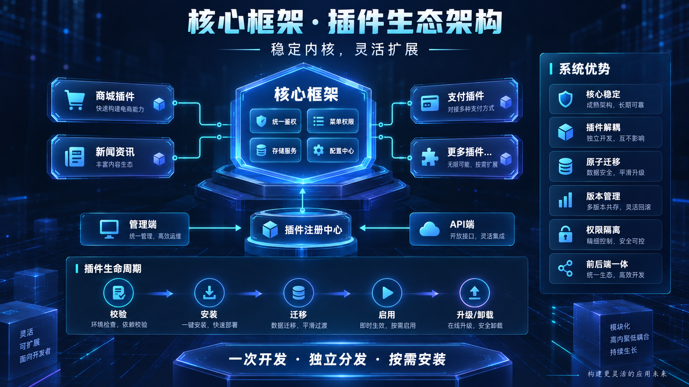
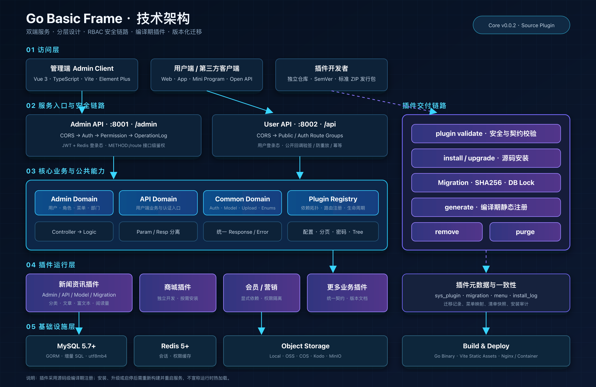
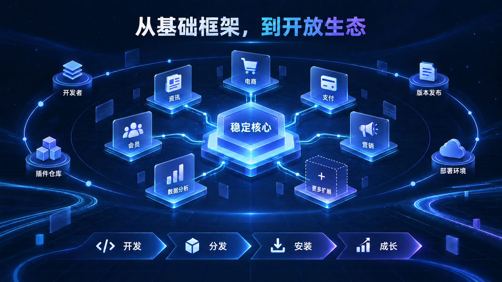

# 从后台脚手架到插件生态：Go Basic Frame，让业务能力真正可复用

> 一个稳定的核心，一套清晰的规范，一条从开发、分发到安装升级的插件链路。

很多后台项目都有相似的开始：搭建登录、权限、菜单、上传、日志和基础配置，然后再开发真正的业务。随着系统不断增长，新的商城、资讯、会员或营销需求持续进入主仓库，模块边界逐渐模糊，升级成本也越来越高。

Go Basic Frame 希望解决的不只是“快速搭一个后台”，而是另一个更长期的问题：**如何让基础能力保持稳定，让业务模块能够独立开发、独立发行、按需安装，并逐步形成可持续的插件生态。**

下面这张纯技术架构图展示了系统从访问层、双端服务入口、中间件安全链路，到核心业务、插件运行时与基础设施之间的实际关系：

## 一套可以直接进入业务开发的基础框架

Go Basic Frame 采用前后端分离架构。后端基于 Go、Gin、GORM、MySQL、Redis 和 JWT，管理端基于 Vue 3、TypeScript、Vite、Element Plus 与 Pinia。管理端 API 和用户端 API 拥有独立的服务入口与路由，可根据业务规模分别部署。

框架已经覆盖后台系统中高频但容易重复建设的能力：

- JWT 与 Redis 登录态，支持主动退出、密码变更失效和管理员踢下线；
- 菜单、角色、部门树及接口级 RBAC 权限控制；
- 后端菜单驱动的动态路由，以及精确到按钮的前端权限展示；
- 管理端操作日志、敏感参数脱敏、请求响应审计；
- 本地、阿里云 OSS、腾讯云 COS、七牛云 Kodo、MinIO 多渠道存储；
- 短信、微信、支付、平台品牌等常用配置模块；
- 统一参数校验、响应结构、分页、错误处理和文件地址补全；
- 明暗主题、标签页、水印、全屏、个人设置和平台 Logo 动态配置；
- 服务启动自检、HTTP 超时控制与优雅停机。

这些功能不是互相独立的演示页面，而是按照同一套数据结构、接口权限和工程规范连接起来的完整基础设施。开发者可以把注意力直接放在业务上，而不必再次拼装一套登录、权限和后台布局。

## 核心框架负责稳定，插件负责变化

传统“所有功能都进入主仓库”的模式，短期开发简单，长期却容易让核心系统和具体业务相互绑死。Go Basic Frame 从 `v0.0.2` 开始引入源码级插件体系，将系统拆分为两个边界清晰的部分。

核心框架负责长期稳定的公共能力，包括认证、权限、菜单、上传、配置、日志、数据库连接、统一响应和服务生命周期；插件负责快速变化的业务能力，例如新闻资讯、商城、会员、营销和数据分析。

插件复用宿主的基础设施，不复制另一套鉴权、上传或响应代码。管理端插件默认进入完整的“登录校验 → 接口权限 → 操作日志”链路，用户端插件则根据业务需要接入公开或登录路由组。前端页面通过插件注册中心进入动态路由，但仍然遵循主项目的主题、组件和权限规则。

这意味着扩展业务时，不需要破坏核心框架，也不需要在每个项目里重新开发同一套模块。

## 插件不只是一个目录，而是一套完整交付机制

Go Basic Frame 的插件设计覆盖了开发、校验、安装、迁移、启用、升级、移除与彻底清理的完整生命周期。

一个标准插件发行包可以同时携带：

- Go 后端代码及管理端、用户端接口；
- Vue 管理端页面、组件、类型和枚举；
- 按版本维护的数据库迁移；
- 菜单与按钮权限声明；
- 插件清单、依赖关系和版本约束；
- 每个版本独立的 API、数据库与更新说明。

插件安装器会检查 ZIP 路径穿越、符号链接、文件数量、包大小、插件 ID、核心版本、依赖关系、迁移摘要及菜单业务键。插件不能指定系统菜单主键，而是通过稳定的业务键生成数据库自增 ID，从机制上降低不同环境之间的 ID 冲突风险。

数据库迁移、菜单映射、插件信息和安装记录被纳入一致性控制；同一插件的安装与升级使用数据库级互斥锁串行执行。MySQL DDL 无法与业务元数据处于同一个物理事务，因此迁移脚本被要求可安全重试，安装器则确保菜单和插件元数据不会留下半套状态。

已经发布的迁移不可修改，只能通过更高版本继续向前演进。插件 API、数据库引用和版本更新说明也必须按版本归档，让一次升级不仅“能够执行”，还能够审查、追溯和回滚。

## 独立仓库、语义化版本、标准发行包

插件推荐采用“一插件一仓库”的方式维护。开发者从匹配的核心版本建立插件项目，后续功能和修复都在插件自己的分支、标签与发布流程中完成，不必反复把插件开发分支合并进核心仓库。

版本遵循语义化规则：

- 不兼容调整提升主版本；
- 向后兼容的新功能提升次版本；
- 问题修复、界面优化和文档调整提升修订版本。

`plugin.json`、Go Manifest、Git 标签、版本文档和发行 ZIP 必须保持一致。安装或升级后，注册文件由工具自动扫描生成，不再要求开发者手工修改核心注册代码。

当前插件采用**源码级、编译期注册**模式。它不会在运行中加载来源未知的 Go 动态库或远程 JavaScript；插件安装、升级、启停后需要重新检查构建并重启服务。这个选择牺牲了“运行时热加载”的表面便利，换来更明确的代码审查、依赖管理、构建检查和生产安全边界。

## 新闻资讯插件：插件体系的真实落地

现有新闻资讯插件已经验证了这套机制并非停留在接口定义层面。它包含新闻分类、文章管理、启用状态、封面、摘要、富文本正文、真实阅读量与虚拟阅读量等完整业务能力，同时具备独立的前后端代码、菜单权限、数据库迁移、API 文档和版本更新说明。

插件页面沿用主系统 UI，表单组件与列表页面分离；管理端接口复用 RBAC 权限与操作日志；业务表使用独立的 `plg_news_*` 前缀；升级通过新增版本迁移持续演进。它既是一个可以使用的业务模块，也是后续商城、内容、会员类插件的参考实现。

## 系统亮点：不仅是功能多，更重视长期维护

### 1. 权限边界统一

前端权限决定按钮是否展示，后端权限中间件才是真正的安全边界。权限使用 `METHOD:/route` 精确匹配，普通角色不会自动获得新插件或高风险操作权限。

### 2. 数据结构有明确规则

数据库不依赖运行时 `AutoMigrate`。所有表和字段必须有注释，字符集统一为 `utf8mb4_general_ci`，枚举从 `1` 开始，结构变化通过增量 SQL 交付。业务文件字段只保存相对路径，访问地址根据当前存储配置统一补全，避免更换域名或存储渠道时批量修改业务数据。

### 3. 分层不是口号

Controller 只负责参数绑定和统一响应，业务规则与事务进入 Logic；Logic 不直接返回 Model，而是转换为独立 Resp；Param、Resp、前端 API、Type 和表单组件均按功能拆分。核心和插件遵循同一套规范，降低多人协作与长期演进中的风格漂移。

### 4. 安装与升级可以审计

插件版本、迁移摘要、安装结果、耗时和错误信息都会留下记录。数据库引用文档必须明确核心表引用、其他插件引用、文件归属以及 Remove/Purge 的影响，避免删除插件时才发现隐藏依赖。

### 5. 前后端作为一个插件交付

一个业务能力通常不仅有接口，也有页面、组件、权限和数据结构。Go Basic Frame 将这些内容放进同一个标准发行包，使插件交付不再是“后端代码装好了，前端还要手工复制一遍”。

### 6. 对生产环境保持克制

系统不会为了追求“动态”而绕过编译、鉴权和数据库检查。公开回调必须自行实现验签、防重放、限流与幂等；未编译、版本不一致、迁移缺失或依赖异常的已启用插件会阻止服务启动，并给出明确错误。

## 从一个项目，走向可协作的业务生态

插件化真正有价值的地方，不是把代码换一个目录，而是让业务能力形成可以持续复用的产品。

未来，一个开发者可以专注商城插件，另一个团队可以维护资讯、会员或营销插件；插件拥有独立仓库、版本、文档和发布节奏，核心框架则持续提供稳定的认证、权限、上传、配置和运行基础。项目使用者可以根据场景组合能力，插件开发者也可以围绕标准接口持续迭代，而不必维护一份长期分叉的核心代码。

适合基于 Go Basic Frame 构建的场景包括：

- 企业管理后台与内部运营平台；
- SaaS 管理端及多业务控制台；
- 内容、资讯、知识库和门户系统；
- 商城、会员、营销和支付类业务；
- 需要持续增加行业模块的定制化项目；
- 希望沉淀自有插件库的开发团队。

## 现在加入，参与定义下一阶段

Go Basic Frame 仍在持续完善中。当前阶段已经完成基础后台能力、双端服务架构和插件开发、分发、安装、升级、移除的核心链路，下一阶段将围绕更多业务插件、插件质量检查、生态展示与开发体验继续演进。

如果你正在寻找一套结构清晰、权限完整、能够继续扩展的 Go 后台框架，或者希望把团队积累的业务模块变成可维护、可分发的插件，欢迎体验、提交 Issue、参与贡献，也欢迎一起构建更丰富的插件生态。

| 官网 | 管理端源码 | 接口端源码 | 接口文档 |
| --- | --- | --- | --- |
| [访问官网](https://www.tutudati.com/) | [查看管理端](https://gitee.com/open-source-project-open/go_basic_frame_admin) | [查看接口端](https://gitee.com/open-source-project-open/go_basic_frame_api) | [在线接口文档](https://s.apifox.cn/a42d392b-c5e9-4b75-8f54-e1c26339b262) |

**稳定内核，灵活扩展。一次开发，独立分发，按需安装。**
